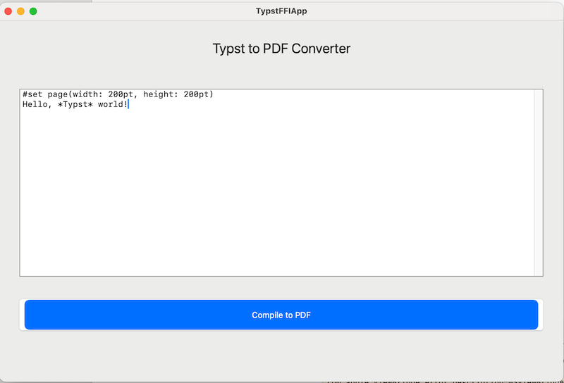

# TypstFFIApp: SwiftUI macOS App with Rust Typst-FFI Library



This project demos how to integate a Rust static library to a SwiftUI macOS app. The app provides a text editor for entering a string of Typst markups, a button to compile it to a PDF, and a save dialog to export the PDF.
```
SwiftUI App (iOS/macOS)          Rust Static Library           System Storage
      │                                │                            │
      │ 1. Call PDF generation func    │                            │
      │───────────────────────────────>│                            │
      │                                │                            │
      │                                │ 2. Generate PDF            │
      │                                │ ┌─────────────────────┐    │
      │                                │ │    PDF Creation     │    │
      │                                │ └─────────────────────┘    │
      │                                │                            │
      │ 3. Return PDF data (byte[])    │                            │
      │<───────────────────────────────│                            │
      │                                │                            │
      │ 4. Save PDF to documents       │                            │
      │────────────────────────────────────────────────────────────>│
      │                                │                            │
```

## Prerequisites
- **Xcode**: Version 16.4 or later.
- **Rust Library**: The `typst-ffi` static library (`libtypst_ffi.a`) and header file (`typst_ffi.h`), built as described in the [`typst-ffi`](https://github.com/bingqiao/typst-ffi) project’s `README.md`.
- **macOS**: Developed for Apple Silicon (arm64).

## Integrating the Rust Library

The `typst-ffi` Rust library provides two functions to be called by Swift code for actually generating a PDF. Below are the steps that created this project.

### Project Setup
Notice, to build and run this project you only need step 2.

But the following lists all the steps involved in creating this project from scratch.
1. **Create the Xcode Project**:
   - In Xcode, create a new macOS App project with SwiftUI interface (e.g., `TypstFFIApp`).
   - Save it to a directory (e.g., `~/TypstFFIApp`).

2. **Add the Rust Library**:
   - Copy `libtypst_ffi.a` and `typst_ffi.h` from the `typst-ffi` project to the Xcode project directory:
     ```bash
     cp ~/typst-ffi/target/release/libtypst_ffi.a ~/TypstFFIApp/
     cp ~/typst-ffi/typst_ffi.h ~/TypstFFIApp/
     ```
   - In Xcode, go to **File > Add Files to "TypstFFIApp"** and add `typst_ffi.h`. (N.B. if you also add `libtypst_ffi.a`, you will likely get a duplicate linker flag warning from build)
   - Ensure `libtypst_ffi.a` and `typst_ffi.h` are included in the **Target Membership** for the app target.

3. **Create a Bridging Header**:
   - Create a file named `TypstFFIApp-Bridging-Header.h` in the project directory:
     ```c
     #ifndef TypstFFIApp_Bridging_Header_h
     #define TypstFFIApp_Bridging_Header_h

     #include "typst_ffi.h"

     #endif
     ```
   - In Xcode, go to **Build Settings**, search for **Objective-C Bridging Header**, and set it to:
     ```
     $(SRCROOT)/TypstFFIApp-Bridging-Header.h
     ```

4. **Configure Build Settings**:
   - In **Build Settings**:
     - **Library Search Paths**: Add `$(SRCROOT)` to locate `libtypst_ffi.a`.
     - **Other Linker Flags**: Add:
       ```
       -ltypst_ffi -lc++ -lm -ldl -lpthread -framework CoreFoundation -framework Security
       ```
     - **Architectures**: Set to `arm64` for Apple Silicon (or `$(ARCHS_STANDARD)` for universal binaries).
     - **Excluded Architectures**: Add `x86_64` for archiving if targeting only arm64.
   - In **Build Phases > Link Binary With Libraries**, ensure `libtypst_ffi.a` is listed.

5. **SwiftUI Implementation**:
   - The `ContentView.swift` file implements a SwiftUI interface with:
     - A `TextEditor` for Typst input.
     - A button to call `compile_typst`, which converts the input to a PDF.
     - An `NSSavePanel` to save the PDF output.
     - A status message to show success or errors.
   - The Rust library’s `compile_typst` function is called via FFI, with memory management handled by `free_typst_buffer`.

## Building and Running
1. **Build the App**:
   - Open `TypstFFIApp.xcodeproj` in Xcode.
   - Select the app target and a macOS destination (e.g., **My Mac (Apple Silicon)**).
   - Press **Cmd + B** to build or **Cmd + R** to run.

2. **Test the App**:
   - Enter Typst code (e.g., `#set page(width: 200pt, height: 200pt)\nHello, *Typst* world!`).
   - Click **Compile to PDF**.
   - Save the PDF via the save dialog and verify its contents.

3. **Archive for Distribution**:
   - Go to **Product > Archive**.
   - In **Window > Organizer**, select the archive and click **Distribute App > Export**.
   - Choose **Custom** then **Copy App** for local share.
   - Save the exported `TypstFFIApp.app` and share it (e.g., as a `.zip`).

## Troubleshooting
- **Linker Errors**:
  - Ensure `libtypst_ffi.a` is in the project directory.
  - Verify **Library Search Paths** and **Other Linker Flags** are correct.
- **Architecture Issues**:
  - For arm64-only builds, exclude `x86_64` in **Excluded Architectures** during archiving.
- **PDF Issues**:
  - If PDFs are corrupted, verify the `NotoSans-Regular.ttf` font is embedded in the Rust library.
  - Add debug logging in `typst-ffi`’s `lib.rs` to trace errors.
